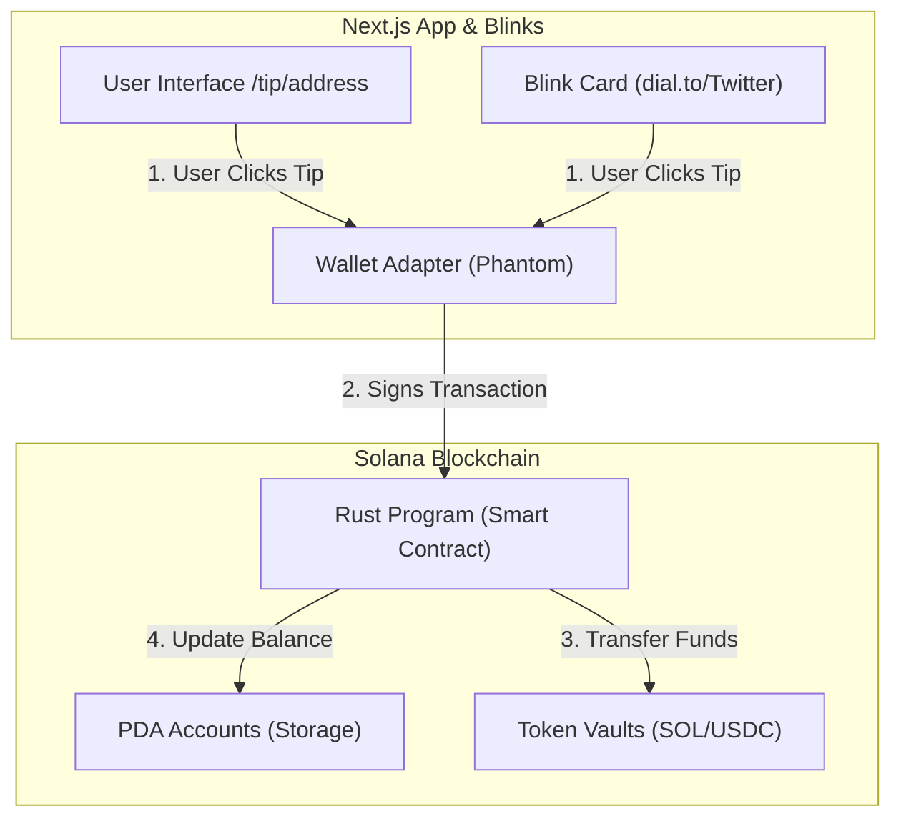

# Portfolio Guide: Blink Tipping Platform

## 1. 🏗 System Architecture (How it works)

This is a **Full Stack Web3 Application**. It connects a user's wallet (Frontend) to the Solana Blockchain (Backend) using specific "Instructions".

### The "Magic" Flow:
1.  **Frontend (`/app`)**:
    *   **Pages**: `app/page.tsx` (Home), `app/tip/[address]/page.tsx` (Tipping Form).
    *   **API**: `app/api/actions/tip/route.ts` is the **Blink** engine. When Twitter/Dial.to sees your link, it hits this API to "GET" the metadata (title, icon) and "POST" the transaction.
2.  **Backend (`/programs`)**:
    *   **`lib.rs`**: The main entry point. It acts like a traffic cop, directing "Tip" or "Withdraw" requests to the right logic.
    *   **`initialize_creator.rs`**: Sets up a new user's "bank account" (PDA) on-chain.
    *   **`send_tip.rs`**: The logic that moves money from the User's wallet -> The Platform's Vault.
    *   **`withdraw_tips.rs`**: The logic that checks if you are the owner, calculates the 0.25% fee, and sends the rest to your wallet.

---

## 2. 🎥 Demo Video Script (For Recruiters/PMs)

**Goal**: A 60-90 second video using tools like **Loom** or **OBS**.

**Opening (0:00-0:15)**:
*   "Hi, I'm [Name]. I built a decentralized tipping platform on Solana called Blink Tipping. It solves the problem of friction in creator monetization by allowing tips directly within twitter feeds using Solana Blinks."

**The Problem & Solution (0:15-0:30)**:
*   "Normally, you have to click a link, go to a bio, finding a payment link... it's slow. With my app, it's instant."
*   *Show the `dial.to` Blink card on screen.*

**Technical Deep Dive (0:30-1:00)**:
*   "I built this using a **Monorepo** structure."
*   "The **Backend** is written in **Rust** using the Anchor framework. It handles secure, non-custodial fund management using PDAs (Program Derived Addresses)."
*   "The **Frontend** is **Next.js 14**. I implemented a custom API route that complies with the Solana Actions standard to generate these interactive cards."
*   *Briefly flash your VS Code showing the clean folder structure.*

**The Demo (1:00-1:30)**:
*   "Let me show you it working live on Devnet."
*   "Here I am as a user sending 1 USDC." *(Click execute in dial.to)*
*   "And here is the Creator Dashboard updating instantly." *(Switch to localhost dashboard tab)*
*   "This handles real on-chain state updates with sub-second finality."

**Closing**:
*   "It's fully open source and valid for mainnet deployment. Thanks for watching."

---

## 3. 🚀 Portfolio Checklist

- [ ] **Record the Video**: Use the script above.
- [ ] **Deploy Frontend**: Even if the backend is on Devnet, you can deploy the Next.js app to **Vercel** for free. This gives you a `blink-tipping.vercel.app` link to put on your resume.
- [ ] **Architecture Diagram**: Include the diagram above in your README (I can render it for you if you like).

---

## 4. 🌟 Portfolio Polish: AI Tools

Great question! **Google NotebookLM** is amazing, but it works a bit differently than you might think.

### 🎙 Use NotebookLM for "Audio Overviews"
NotebookLM won't *draw* a diagram for you, but it can read this `PORTFOLIO_GUIDE.md` and your `README.md` and generate a **Deep Dive Podcast** about your project.
1.  Go to [notebooklm.google.com](https://notebooklm.google.com).
2.  Upload your `README.md` and this guide.
3.  Click **"Generate Audio Overview"**.
4.  **Result**: Two AI hosts will have an enthusiastic conversation about your "Blink Tipping Platform". You can embed this audio on your portfolio site!

### 🎨 Use Eraser.io or Excalidraw for "Beautiful Diagrams"
If you want a diagram that looks better than the standard Mermaid box-and-arrow:
1.  **Excalidraw.com**: Free, hand-drawn style (very popular in tech). Copy the "System Architecture" text from this guide and draw it there.
2.  **Eraser.io**: specifically designed for "Diagrams as Code" but with a much more polished, modern look than standard markdown.

**Recommendation**:
Take the **System Architecture** text from Section 1, paste it into ChatGPT or Claude, and ask: *"Turn this description into a prompt for a Mermaid diagram that looks like a sequence diagram"* OR just draw it manually in Excalidraw for that custom touch.
