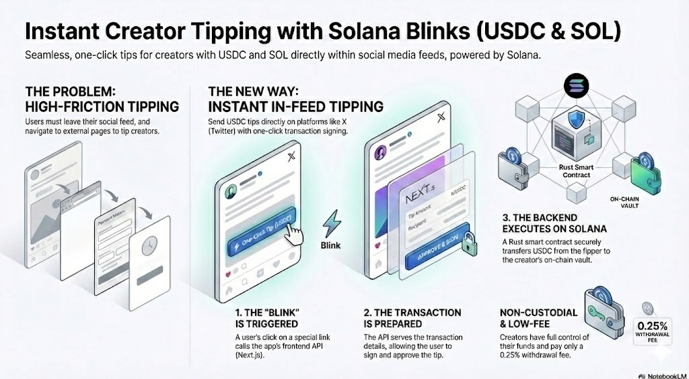

# Blink Tipping Service ⚡️

A decentralized, non-custodial tipping platform on Solana that integrates with **Solana Blinks/Actions** to allow tipping directly from X (formerly Twitter).



## 📂 Project Structure

This is a **monorepo** containing both the Solana smart contract (backend) and the Next.js application (frontend).

```
blink-tipping/
├── programs/           # 🦀 Rust Smart Contract (Solana Program)
├── tests/              # 🧪 TypeScript Integration Tests for Anchor
├── app/                # 🌐 Next.js Frontend & Blinks API
├── Anchor.toml         # ⚓️ Anchor Configuration
└── ...
```

---


## 🛠 Prerequisites

- **Node.js** (v18+)
- **Rust & Cargo** (latest stable)
- **Solana CLI** (v1.18+)
- **Anchor CLI** (v0.29+)
- **Yarn** or **npm**

---

## 🦀 Backend (Solana/Anchor)

The backend handles the tipping logic, fee collection (0.25%), and withdrawals.

### 1. Setup
```bash
# Install dependencies
npm install

# Build the program
anchor build
```

### 2. Testing (Local Validator)
```bash
# Run the test suite
anchor test
```

### 3. Deployment (Devnet)
1.  Configure Solana to Devnet: `solana config set --url devnet`
2.  Ensure you have SOL: `solana airdrop 2`
3.  Deploy: `anchor deploy`
4.  **Important**: After deployment, update `declare_id!()` in `programs/blink-tipping/src/lib.rs` and `Anchor.toml` with your new Program ID.

---

## 🌐 Frontend (Next.js + Blinks)

The frontend provides the User Interface for tipping, dashboard management, and the API endpoints for Solana Actions (Blinks).

### 1. Setup
Navigate to the app directory:
```bash
cd app
npm install
```

### 2. Configuration
Create a `.env.local` file in the `app/` directory:
```env
# Solana Configuration
NEXT_PUBLIC_SOLANA_RPC_URL=https://api.devnet.solana.com
NEXT_PUBLIC_PROGRAM_ID=<YOUR_PROGRAM_ID>

# Token Mints (Devnet)
NEXT_PUBLIC_USDC_MINT=4zMMC9srt5Ri5X14GAgXhaHii3GnPAEERYPJgZJDncDU

# Security (Access Control)
NEXT_PUBLIC_PLATFORM_OWNER_PUBKEY=<YOUR_WALLET_PUBLIC_KEY>
```

### 3. Running Locally
```bash
npm run dev
```
The app will start at `http://localhost:3000`.

### 4. Key Pages
- **Tip Page**: `http://localhost:3000/tip/[WALLET_ADDRESS]`
- **Blink API**: `http://localhost:3000/api/actions/tip/[WALLET_ADDRESS]`
- **Dashboard**: `http://localhost:3000/dashboard` (Connect wallet to view)
- **Admin Test**: `http://localhost:3000/test` (Restricted to owner)

---

## 🧪 Testing Blinks

To test the Blink integration (card UI on Twitter):

1.  Go to [dial.to](https://dial.to) (Solana Blinks Inspector).
2.  Paste your local API URL:
    `http://localhost:3000/api/actions/tip/[CREATOR_ADDRESS]`
3.  You should see the "Send a Tip" card with SOL and USDC options.

---


